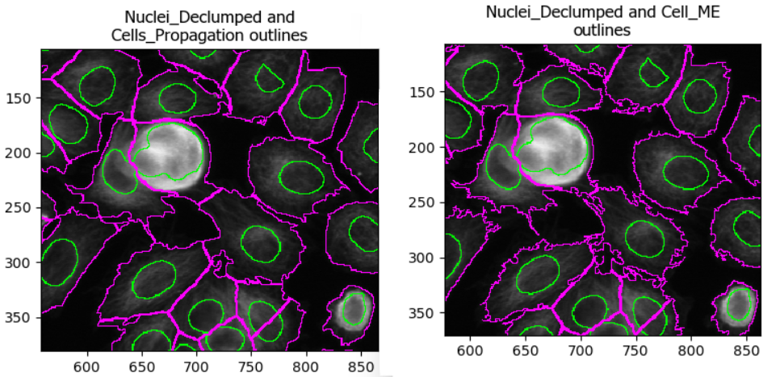

::: questions
-   How can we detect whole cells once we have identified nuclei?
-   What does is the differences between detecting primary and secondary
    objects?
-   Which settings matter most for cell boundary detection?
:::

::: objectives
-   Use **IdentifySecondaryObjects** to segment whole cells from an actin image.
-   Understand how secondary objects depend on primary objects.
-   Learn how propagation-based segmentation expands from nuclei to cell edges.
-   Create a cell object set suitable for per-cell measurements.
:::

## Introduction: from nuclei to whole cells

In the previous episode, we identified nuclei as **primary objects**. This gives
us reliable “seed” objects: one nucleus (ideally) per cell.

However, many biologically interesting measurements (e.g. cell area, shape
and cytoplasmic fluorescence) require us to segment the **whole cell**. This is
often more challenging than nuclei segmentation because:

-   cytoplasm and boundaries can be **fainter** than nuclei,
-   neighboring cells may **touch** or overlap,
-   staining can be **uneven** across the cell body.

To tackle this, CellProfiler provides **IdentifySecondaryObjects**, which grows
secondary objects outward from nuclei using information from another image (here
an actin channel). This approach helps prevent ambiguous assignments of boundary
pixels by ensuring each cell is linked to exactly one starting nucleus.

## The IdentifySecondaryObjects module

Add a new module via **+ Add** → **Object Processing** → **IdentifySecondaryObjects**.

You should now see a module where you need to specify:

1. which primary objects act as “seeds” (nuclei),
2. which image contains cell boundary information (actin),
3. how to determine where each cell ends (thresholding + method),
4. how to handle cells the image border.

### Step 1: choose primary input objects (the seeds)

Set **Select the input objects** (or similarly named setting) to `Nuclei` or
the name you set in the previous lesson. This tells CellProfiler that each cell
object should be grown outward from one nucleus.

### Step 2: choose the correct input image (actin)

Set **Select the input image** to your actin (or cytoplasmic) channel, e.g.
`Actin` (or whatever name you assigned in *NamesAndTypes*).

This image should contain relatively strong signal across the cell body and/or
along the cell boundary.

:::: challenge
## Challenge: confirm the actin image is suitable for cell boundaries

Using Test Mode, inspect a few images:

-   Can you see whole cell bodies?
-   Are neighboring cells separable?
-   Is the background reasonably dark?

If not, what issues do you observe?

::: solution
#### Solution (placeholder)

*Placeholder:* Provide an example description of what “good” vs “difficult”
actin staining looks like for segmentation in this dataset.
:::
::::

### Step 3: choose a method to identify secondary objects

`IdentifySecondaryObjects` offers multiple approaches to build cells from nuclei.
In this course, we will use a method that expands outward from nuclei and uses
the actin image to decide where boundaries should fall.

*Placeholder:* Briefly explain the intuition in your own words (1–2 sentences):
“cells grow from nuclei until actin signal indicates a boundary / until reaching
a threshold / until meeting another cell”.

:::: challenge
## Challenge: explore methods (optional exploration)

Try two different methods (e.g. propagation vs watershed gradient).
How do the resulting cell boundaries differ?

::: solution
#### Comparing methods

As with the segmentation of nuclei, getting cell segmentation can be tricky.
Often, starting with "propagation" as method is a good starting point,
because watershed can expand into neighboring cells (see below). But you can
certainly find areas of the image where the reverse is true. This means that,
once again, choices should be made carefully.
{alt="Comparing two methods
of identifying cell boundaries: watershed and propagation. Using watershed,
some cell boundaries spill over into adjacent cells, leading to incorrect
cell masks."}

:::
::::

### Step 4: choose a threshold strategy and threshold method

Much like when segmenting nuclei, the `IdentifySecondaryObjects` module
allows us to fine-tune our segmentation by changing the thresholding strategy
and method. As before, the best choice depends on illumination and staining
consistency. While **Minimum Cross-Entropy** (right) is the default thresholding
method, **Propagation** (left) often yields less jagged cell boundaries:

{alt="Side-by-side of propagation and
minimum cross-entropy threshold results."}

:::: challenge
## Challenge: biological pitfalls

Think about the assumptions CellProfiler is making in its identification of
secondary objects. Can you think of biological samples where these
assumptions may not be met? Discuss with your neighbor.

::: solution
CellProfiler identifies cells by expanding outwards from a nucleus.
This assumes that each cell only has exactly one nucleus in the same plane.
When imaging hepatocytes, for example, this can prove problematic: they often
contain more than one nucleus. Equally, if we were imaging cells in suspension,
we would have to make sure than we capture the nucleus accurately in 3D and 
expand the cell in 3D space too. And lastly, red blood cells do not even
have a nucleus, so this method would not work for them either!

Other pitfalls include mitotic/meiotic cells: from when on do we term a 
splitting cell as two cells?
When the two nuclei have budded off, or when the membrane is fully
split?
CellProfiler cannot answer these questions for us, instead, we must consider
these biological complexities when designing our analysis pipeline to not
yield nonsensical data down the line.
:::
::::

## Identifying cytoplasm

You have now created whole-cell objects from nuclei seeds
and an actin image. With nuclei and cells in hand, we can create one last
object: the cytoplasm.

## Conclusions

Finally, we can move on to measure things! 

### Help

Did you get stuck with one of the steps? Download a working version of the
pipeline here:

<a href="data/pipeline_secondary.cppipe" download class="btn btn-primary" style="display:inline-block;padding:8px 12px;background:#007bff;color:#fff;border-radius:4px;text-decoration:none;">Download pipeline</a>

:::::::::: callout
If you are using Firefox, you have to right click the button and select "Save Link As...".
::::::::::

If you like, you can compare this pipeline to yours. To do so, first open a new
CellProfiler window. Then, import this pipeline in CellProfiler by clicking on
File > Import > Pipeline from File.

::: keypoints
-   Secondary objects (cells) are typically grown from primary objects (nuclei)
    using a cytoplasmic/cell-boundary stain (here: actin).
-   Filtering border-touching nuclei helps avoid partial cells and misleading
    measurements.
-   The most important settings in **IdentifySecondaryObjects** are the
    identification method and thresholding choices, which strongly affect
    whether cells merge or fragment.
:::
