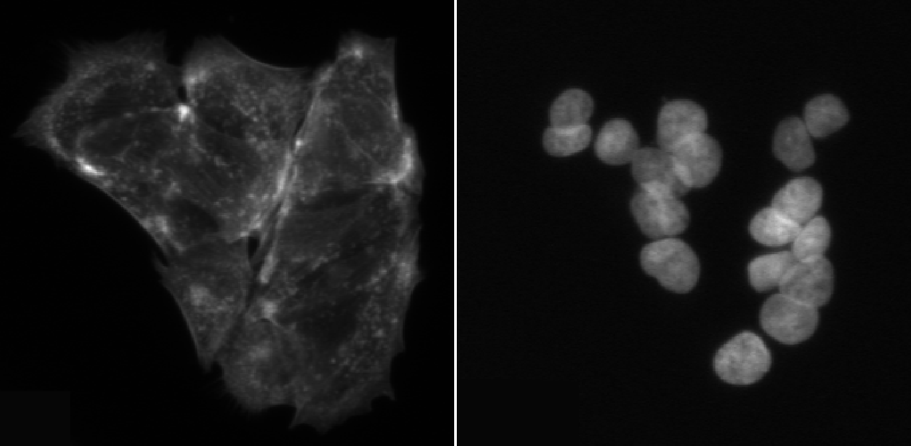

::: questions
-   How does CellProfiler identify objects in an image?
-   Why do we usually start segmentation with nuclei?
-   Which parameters matter most for good nucleus segmentation?
:::

::: objectives
-   Understand what primary objects are in CellProfiler.
-   Configure the **IdentifyPrimaryObjects** module to segment nuclei.
-   Learn how to assess segmentation quality using the Test Mode viewer.
-   Produce a nucleus object set suitable for downstream cell/feature analysis.
:::

## Introduction: why segment nuclei first?

In this episode, we will segment **nuclei** as our **primary objects**. In many
microscopy assays, nuclei are an ideal starting point because they are:

-   **High contrast** in a DNA channel (bright nuclei on a dark background),
    making them easier to separate from non-cell regions.
-   **Present in (almost) every cell**, giving a reliable “anchor” object for
    counting cells and linking measurements.
-   Typically **compact and well-defined**, which helps the segmentation
    algorithm succeed even when cell boundaries are faint.

{alt="Side by side image of cells stained for microtubules and nuclei. Nuclei are more easily discerned from each other."}

Once nuclei are correctly identified, we can often use them to guide later steps
like finding whole cells (secondary objects) or cytoplasm (tertiary objects),
and to compute per-cell measurements.

In CellProfiler’s terminology:
-   **Primary objects** are detected directly from an image (here: nuclei from
    the DNA channel).
-   **Secondary objects** are grown out from primary objects (often whole cells).
-   **Tertiary objects** are derived from other objects (often cytoplasm =
    cell minus nucleus).

## The IdentifyPrimaryObjects module

Add a new module via **+ Add** → **Object Processing** → **IdentifyPrimaryObjects**.

{alt="Screenshots of CellProfiler, showing how to add the IdentifyPrimaryObjects module."}

You should now see a module where you need to specify:
1. which image to segment,
2. what to call the resulting objects,
3. how CellProfiler should separate touching nuclei,
4. what size and shape constraints to apply,
5. and (optionally) how to filter out artifacts.

### Step 1: choose the correct input image

Set **Select the input image** to the DNA/nuclear stain image (i.e. `DNA`, if 
you followed the steps in the 
[previous episode](introduction.Rmd#namesandtypes)).

Set **Name the primary objects to be identified** to something descriptive like
`Nuclei`.

:::: challenge
## Challenge: confirm you are using the correct channel

How can you quickly verify that you selected the **DNA** image (and not actin or
tubulin)?

::: solution
#### Solution
##### Using interactive test mode
One way to verify the image that is being segmented is to use CellProfiler's 
interactive test interface. To do this, first make sure the eye symbol next to
the module is enabled (dark). If it is a disabled (light grey), click on the eye
(step 1 in the figure below). Second, start test mode and run the first step.
A new CellProfiler window will open, that shows the image that is being
segmented next to the segmentation results. Do the objects in the top left image
look like nuclei? You can zoom in using the magnifying glass (step 4 in figure).
{alt="Screenshots of CellProfiler, showing how
to use the test interface to see which channel is being segmented."}

Nuclei should show as compact, round, and high-contrast objects, as in the 
figure above. If you get a different result, make sure to double-check your 
settings for the segmentation and metadata modules.
:::
::::

### Step 2: set an expected nucleus diameter (in pixels)

CellProfiler needs an approximate size range for objects. Set:

-   **Typical diameter of objects, in pixel units (Min, Max)** to a range that
    matches your nuclei.

This is one of the most important parameters. If the minimum is too small,
you may pick up noise; if the maximum is too small, large nuclei may be split.

:::: challenge
## Challenge: estimate nucleus size

Using a representative image, estimate a reasonable nucleus diameter range.

::::: solution
#### Solution: diameter range

To estimate nuclei size range, it is good to measure the diameter of a few 
nuclei in a representative image. 
We can do so by using the measure tool in CellProfiler. From the test interface
used in the previous challenge, we can access the measure tool (step 1 in 
figure). Then, by clicking and dragging the cursor (2), we can measure the
length in pixels, which is displayed in the bottom right of the window (3).
By repeating this process for a few nuclei, ideally across a few images, we
can gain a good intuition for typical nuclei diameters.

{
alt="Screenshots of CellProfiler showing that nuclei diameters can be estimated
using the measurement tool."}

::::::: callout
Note: in bigger experiments, this should be repeated with different 
experimental conditions to make sure we are not biasing analyses.
:::::::

:::::

::::

### Step 3: choose a thresholding strategy (foreground vs background)

CellProfiler separates nuclei (foreground) from background using a threshold.
In the advanced settings of **IdentifyPrimaryObjects**, you have the choice of
two threshold strategies: 

-   **Global thresholding** (one threshold per image)
-   **Adaptive thresholding** (threshold varies across the image)

Set the thresholding method appropriate for your images. If illumination is
uneven or background varies strongly, adaptive methods often perform better.

:::: challenge
## Challenge: compare thresholding options

Run the module in Test Mode on 2–3 images and compare at least two thresholding
settings. Look out for things like

-   Nuclei being merged or split (over- and undersegmentation)
-   Background being included in foreground

Which setting best matches what you consider nuclei?

:::::: callout
Note that CellProfiler colors nuclei it will remove in subsequent analyses
in purple outlines. These nuclei are removed because they either do not fit
the set diameter range, or because they are touching the border. Nuclei that
will be kept are outlined in green.
::::::

::: solution
#### Solution

In this dataset, as if often the case, it is difficult finding perfect settings!
Ideally, one spends a significant portion of time optimizing the settings to
make sure that results are biologically representative of cells. In the figure 
below, you can see
that changing the segmentation strategy and method to "Adaptive" and "Otsu",
respectively, may not make much of a difference. But results of the 
segmentation with adaptive Otsu show that some pixels that are parts of nuclei
are discarded (top right). Note that the result will also be affected by
the settings we will change next.
{alt="Side by side comparison of segmentation
results with different segmentation strategies"}
:::
::::

### Step 4: declump touching nuclei

Nuclei often touch or overlap, particular if many cells were seeded. While a
z-stack of images can help distinguish which nuclei goes where, due to the
increased imaging time needed and more complex downstream analysis not all 
experiments involve z-stacks. Instead, we can instruct CellProfiler to separate
clumped nuclei using information about nuclei shape and intensity.

While doing so, we need to make sure that **one nucleus corresponds to one 
"object"**.

:::: challenge
## Challenge: tune declumping

Find an image region with several touching nuclei. (In the sample data,
the image of cells treated with cytoD has more clumped nuclei.)
Adjust declumping parameters until most nuclei are separated correctly.

::: solution
#### Solution: declumping
As before, it is not trivial to find ideal declumping settings. We can get
satisfactory results using "Shape" for both, distinguishing clumped objects and
to draw dividing lines here, but not that this will differ for each dataset and
should be carefully tested.

This figure shows the impact of not using declumping at all (left) vs declumping
using "Shape" (right).
{alt="Enabling declumping can help discern nearby
nuclei."}

:::
::::

### Step 5 (optional): filter cells

Depending on your dataset, you may need to exclude:
-   tiny bright specks (dust/hot pixels),
-   very large blobs (out-of-focus regions),
-   edge artifacts.

Within **IdentifyPrimaryObjects**, you can often handle some of this using:
-   size constraints (min/max diameter),
-   smoothing of the image before thresholding,
-   discard objects touching the image border (if appropriate).

*Placeholder:* Decide whether learners should remove border-touching objects in
your course and justify it (e.g. do partial nuclei matter for your analysis?).

:::: challenge
## Challenge: should we exclude border objects?

With your neighbor, discuss whether nuclei touching the image border should be 
kept or removed for your research question formulated in the [previous section](
dataset.Rmd), e.g. "does cytochalasin D induce a morphological change in MCF7 
cells?"

::: solution
#### Solution

In most cases we advise removing cells touching the image border, because when
we move to measuring cell characteristics they will represent outliers. For
example, they may appear as disproportionately small cells because they were cut
off. This does not represent biological changes but technical parameters, which
we are not interested in during the analysis.

:::
::::

## Conclusions

Segmentation is rarely perfect, but it should be fit for purpose. A good
nucleus segmentation typically has:

-   Most nuclei detected (few false negatives)
-   Few background objects detected (few false positives)
-   Reasonable splitting of touching nuclei
-   Consistent performance across conditions (e.g. DMSO vs treatment)

Now that we have `Nuclei` objects, we can detect whole cells, an important step towards measuring features per cell! Therefore, in the next episode we will use the nuclei as anchors to find cell boundaries.

### Help

Did you get stuck with one of the steps? Download a working version of the pipeline here:

<a href="data/pipeline.cppipe" download class="btn btn-primary" style="display:inline-block;padding:8px 12px;background:#007bff;color:#fff;border-radius:4px;text-decoration:none;">Download pipeline</a>

:::::::::: callout
If you are using Firefox, you have to right click the button and select "Save Link As...".

::::::::::

If you like, you can compare this pipeline to yours. To do so, first open a new
CellProfiler window. Then, import this pipeline in CellProfiler by clicking on
File > Import > Pipeline from File.

::: keypoints
-   Nuclei are often the best primary objects because they have high contrast and
    exist in nearly all cells.
-   The most important parameters in **IdentifyPrimaryObjects** are object size,
    thresholding method, and declumping.
-   Always test segmentation on multiple images and across experimental conditions.
:::
