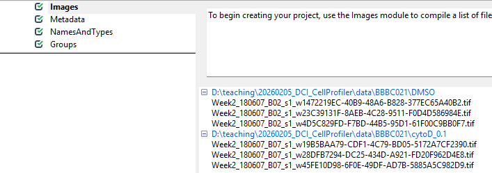

::: questions
-   How do we get started in CellProfiler?
-   How do we teach CellProfiler the structure of our images?
:::

::: objectives
-   Load images in CellProfiler.
-   Understand modules for data loading.
:::

## Understanding preprocessing modules

There are four modules that CellProfiler always uses. In this episode, we will
go through each and show what they are used for.

### Images

Before we can get started with analyzing our images in CellProfiler, we need to
load them in. Start CellProfiler and see whether you can figure out how!

:::: challenge
## Challenge: load the images into CellProfiler

Open CellProfiler and try loading the images into CellProfiler.

::: solution
#### Solution: loading images

You can drag and drop the two folders, `DMSO` and `cytoD_0.1`, onto the white
field in CellProfiler. Afterwards, it should look something like this:
{alt="Screenshot of the CellProfiler `Images` module"}

:::
::::

Now that CellProfiler knows where to find our images, we have to tell it a
little bit about what is *in* the images.

### Metadata

With the images loaded into CellProfiler, we can now start teaching CellProfiler
what image belongs to which sample. For this, we use the Metadata module. This
module's purpose is to translate information that is captured in the file names
into information that CellProfiler can understand.

Get started by click on ´yes´ for ´Extract metadata?´, upon which a menu should
pop open. This is what it looks like by default: 
!(fig/metadata_default.png){Screenshot of the
CellProfiler module "Metadata" with default settings}

Now, we wish to inform CellProfiler about which image contains what. To do so,
set up the module as follows. 
{alt="Screenshot showing metadata module settings"}

While these regular expressions look complicated, they can be crafted more
easily using tools like [regex101.com](https://regex101.com/). Unfortunately,
they are also beyond the scope of our workshop, so feel free to just copy them
from here:

The regular expression may be copied from here:
`^(?P<Treatment>.*)_(?P<Well>[A-P][0-9]{2})_s(?P<Site>[0-9])_channel(?P<ChannelNumber>[0-9])`

:::: challenge
#### Challenge: What is happening here?

The images we are using have names like `cytoD_B07_s1_channel1.tif`. We are
trying to translate these names into metadata with this awkward looking
expression:
`^(?P<Treatment>.*)_(?P<Well>[A-P][0-9]{2})_s(?P<Site>[0-9])_channel(?P<ChannelNumber>[0-9])`.

This is an example of a [regular
expression](https://librarycarpentry.github.io/lc-data-intro/01-regular-expressions).
If you have not heard of regular expressions before, they represent a powerful
way of pattern matching. Here, we use it to decode the file names.

You do not have to understand all the parts, but can you guess which part of the
file name will match which part of the regular expression?

::: solution
#### Solution: regular expressions in CellProfiler

We can break up our file names by underscores. For example,
`cytoD_B07_s1_channel1.tif` can be read as

-   Treatment: `cytoD`
-   Well: `B07`
-   Site: `s1` (site is the image number within a well)
-   Channel: `channel1`

Using the regular expression, we can extract this information from each file
name automatically, as long as it follows the same naming convention.
:::
::::

With this in hand, we can now translate the file names into metadata that
CellProfiler can understand. To see this in action, press on the update button
(top left in the below image), after which you can see the new columns to the
right containing information about the imaging site, the week of the experiment,
the imaged well, and treatment used.

{alt="Screenshot showing the extracted metadata"}

## NamesAndTypes

This module allows us to rename channel numbers to stain names. Recall from the
[dataset introduction](dataset.md) that our stains are for DNA,
actin, and tubulin, imaged in the first, second, and third channel. To make our
lives easier when working with CellProfiler, we therefore wish to rename the
channels to the corresponding stains. This helps us later when we pick the stain
to detect cells from.

To do so, the `NamedAndTypes` modules tells CellProfiler which channel belongs
to which stain. Opening the module, we can see the following defaults:
{alt="Screenshot of the NamesAndTypes module with default
settings"}

Recall that in the Metadata module we extracted the channel number. We can now
make use of this information to assign stain names to the images. To do so, we
switch the "Assign a name" to "Images matching rules" (see below) and then
assign the channels to names. You will have to click "Add another image" to add
a new stain name, filling out the information as in the screenshot and then
clicking "Update".

{alt="Screenshot of the NamesAndTypes module after configuration settings"}

## Groups

You can leave this module untouched for now. It is intended to further group
images by experimental units, such as batches, plates, etc. Here, we only have
two sets of images and do not need the additional grouping.

# Conclusions

To summarise, the preprocessing modules do not make any changes to the images,
but instead translate file and folder names into structures CellProfiler can
understand. As we will see in the next tutorial, this will be useful once we
start working with the images in CellProfiler to do things like detecting cell
boundaries and measure fluorescence intensity. If you have made it this far -
well done! It can feel a bit overwhelming to get started with CellProfiler and
to have it set up properly, but now that we have it in place we can finally
launch into our analysis.

::: keypoints
-   Load images by dragging/dropping them onto CellProfiler's Images module
-   Translate your folder and file names into metadata Cellprofiler can
    interpret using modules.
:::
